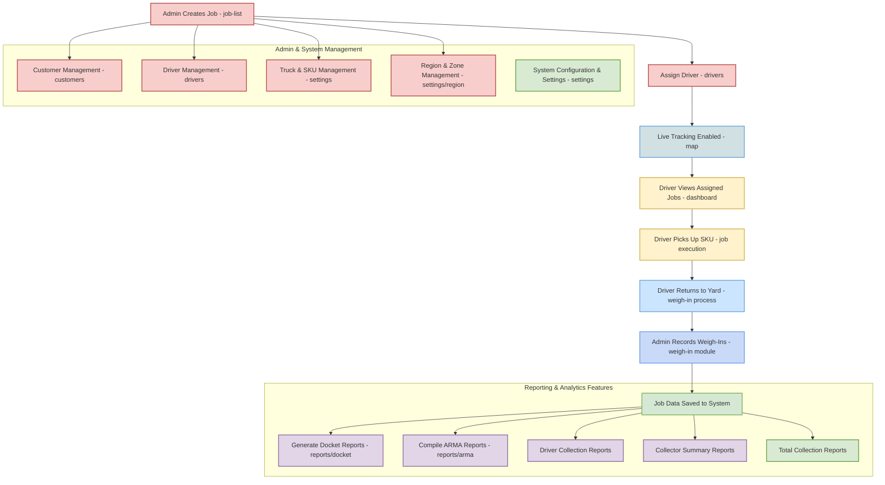

## Project Overview:
- **VB Oil** is an application that tracks the collection of plastic bags, filters, and oil from client sites. Drivers follow a daily schedule, collecting items and returning to the yard where the truck is weighed. After removing and weighing bales, garbage bags, and filters, the scale generates a printed record. This data is submitted to two operators who input it into the software to create a docket, detailing the driver’s activities and collected weights for the day.

- At the end of the month, these dockets are compiled into an ARMA report, a CSV file formatted for Alberta Recycling. Once uploaded and error-free, Alberta Recycling reviews it and issues payment based on the recorded weights.

**Key issues include:**
- Dirty Data: Errors like extra address information, misspelled zones, or missing details, which seem to be mostly resolved.
GMT Time: The software uses GMT, causing date discrepancies when daily reports are finalized in local time. Correcting this should resolve reconciliation issues.

**Work flow:**
- The process is almost entirely manual. The client calls the home office to request a pickup, the manager opens a CALL IN window and logs in the request, which may be weekly, monthly, urgent, or routine. Requests are assigned to drivers based on the address, organized into ARMA-designated zones, and added to the driver’s schedule accordingly.

**Driver:**
- Drivers log into a mobile-optimized website, select their assigned zone, and view their prioritized job list. Jobs are arranged by urgency (e.g., carryovers from previous days) and optimized for shortest travel distance. At each site, drivers load the truck, count collected items (bags, buckets, filters, or oil), and log the data in the app before moving to the next job. Upon returning to home base, they weigh the truck, record the weights of removed items, and manually input the scale-generated data into the system.

<br/>
<br/>



<br/>
<br/>

## Tech Stack
**Frontend:** Next.js (React + TypeScript) <br/>
**Styling:** TailwindCSS + Radix UI + Framer Motion <br/>
**State Management:** Zustand + React Query + React Hook Form <br/>
**Database Validation:** Zod <br/>
**Maps:** Google Maps + Leaflet <br/>
**Build Tools:** PostCSS + Husky + ESLint + Prettier <br/>
**Data Export:** ExcelJS, jsPDF, XLSX <br/>
**Notifications:** Web Push, Sonner <br/>
**Socket Communication:** Socket.io <br/>

<br/>
<br/>

## Features Implemented
**1. System Setup:** <br/>
The foundation of the application allows administrators to manage all primary entities required for operations:
- Clients CRUD
- Driver CRUD
- Truck CRUD
- SKU group and list CRUD
- Regions CRUD <br/>

**2. Job & Data Flow Management:** <br/>
This module handles the creation, assignment, and tracking of collection jobs:
- Admins can create jobs and assign them to specific drivers.
- Driver location and job progress are tracked in real-time.
- Jobs can be monitored in both list view and map view for operational transparency.
- Export job data to Excel for offline analysis or record-keeping.
- Upon returning to the yard, administrators record truck weights and the weights of individual collected items.
- Supports manual form filling for items and generates a docket for the day. <br/>

**3. Reporting & Analytics:** <br/>
VB Oil provides dynamic reporting capabilities to meet internal and regulatory requirements: 
- **Docket Generation:** Automatically creates dockets summarizing driver activities, collected items, and weights.
- **Docket Report System:** Generate reports for custom date ranges with dynamic date selection options.
- **ARMA Report Generation:**
   - Compile monthly collection data into Alberta Recycling-compliant CSV reports.
   - Includes error-checking before submission to ensure accurate payments.
- **Driver Collection Reports:** Detailed reports of each driver’s collection activities.
- **Collector Summary Reports:** Aggregate collection data across all drivers for a given period.
- **Total Collection View:** Comprehensive dashboard showing total collected items, weights, and zone-wise statistics.

<br/>
<br/>

## Folder Structure
```
├── app
│   ├── (auth)                  # Authentication routes
│   ├── (authenticated)         # Application routes (Protected)
│   │   ├── dashboard           # Dashboard page
│   │   ├── job-list            # Job management pages
│   │   ├── customers           # Customer management
│   │   ├── drivers             # Driver management
│   │   ├── weigh-in            # Weigh-in processing
│   │   ├── reports             # Reporting features
│   │   └── settings            # Application settings
│   ├── globals.css             # Global styles
│   └── layout.tsx              # Root layout
├── components
│   ├── dashboard               # Dashboard specific components
│   ├── job-list                # Job list components
│   ├── ui                      # Reusable UI components (Shadcn UI)
│   ├── form                    # Form components
│   ├── map                     # Map integration components
│   └── settings                # Settings components
├── config                      # API configurations
├── contexts                    # React contexts
├── hooks                       # Custom hooks
├── lib
│   ├── api                     # API configurations
│   ├── cache                   
│   ├── export                  # excel or csv export functions
│   ├── schema                  # api response schema
│   ├── server                  # api services
│   └── store                   # zutestand stores
├── providers                   # all providers
├── public                      # Static assets
├── script                      # pwa and other generation script
├── types                       # Type definitions
├── utils                       # Utility functions
└── README.md
```

## Known Issues / Future Improvements
- The project is feature-rich, but the UI/UX needs improvement for faster client work.
- Code refactorization and code splitting.
- Implementation of a map for a single job.
